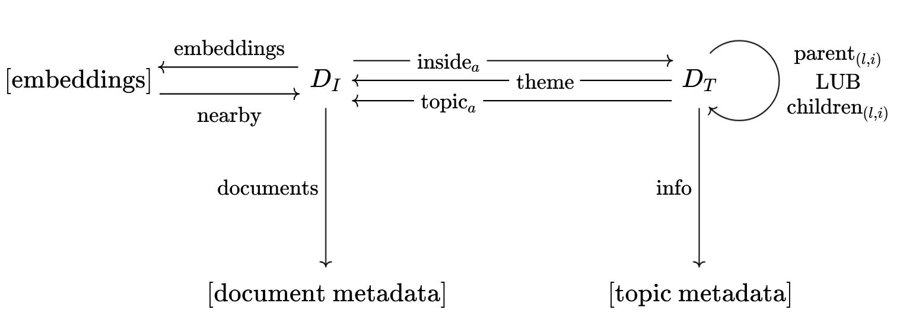

# Thematic Search

Thematic search is a package for *thematic search* on documents that have a hierarchical topic model. 

[More Documentation on ReadTheDocs!](https://thematic-search.readthedocs.io/en/latest/)

## Installation
This is a super alpha version, so you must install from source:

    git clone git@github.com:kalebruscitti/thematic-search.git
    pip install thematic-search

## Basic Usage
To use Thematic Search, you first need a hierarchical topic model of your dataset. This consists of the following items:

- An array `embedding_vectors` of embedding vectors for your documents
- A hierarchical clustering of these documents, encoded as the following:
    1. A set of clusters `(l, i)` for each layer `l` of your hierarchy.
    2. A list of inclusion strength matrices `cluster_layers` where `cluster_layers[l][j,i]` is the inclusion strength of document `j` in cluster `(l,i)` (in [0,1]). 
    3. A dictionary `cluster_tree` whose keys are the clusters `(l,i)` and such that `cluster_tree[(l,i)]` is a list containing the children of `(l,i)` in the tree.
- A dataframe `topic_metadata` with a row for each cluster `(l,i)`.
- (Optional) A dataframe `document_metadata` containing document metadata for each embedding vector.
- (Optional) An array `reduced_vectors` of low-dimensional vectors for each document.

Given these objects, one can intitialize a TopicDatabase:

    topicdb = TopicDatabase(
        SoftClusterTree(
            cluster_layers,
            cluster_tree,
        ),
        embedding_vectors = embedding_vectors,
        reduced_vectors = reduced_vectors,
        document_df = document_metadata,
        topic_df = topic_metadata,
    )

Here are some example queries:

    ## Yields the documents that are nearest neighbours of the embedding of the string;
    print(topicdb.q.search("Advancements in space technology").nearby().documents())

    ## Yields the metadata for the theme of the nearest neighbours of the embedding of the string:
    topicdb.q.search("Advancements in space technology").theme().info()

The full set of possible queries and queries chains is given by composition of arrows in this category:

## Toponymy Integration

Thematic Search is designed to work out-of-the-box with a topic model generated by [Toponymy](https://github.com/TutteInstitute/toponymy). Suppose `toponymy` is a fitted toponymy object - then, using toponymy's serialization class, we can turn it into a TopicDatabase:

    from toponymy.serialization import TopicModel

    topic_model = TopicModel.from_toponymy(toponymy, document_df=my_document_metadata)

    topicdb = TopicDatabase(
        SoftClusterTree(
            topic_model.cluster_layers,
            topic_model.cluster_tree,
            sparsity_threshold = 0.1,
        ),
        embedding_vectors = topic_model.embedding_vectors,
        reduced_vectors = topic_model.reduced_vectors,
        document_df = topic_model.document_df,
        topic_df = topic_model.topic_df,
    )