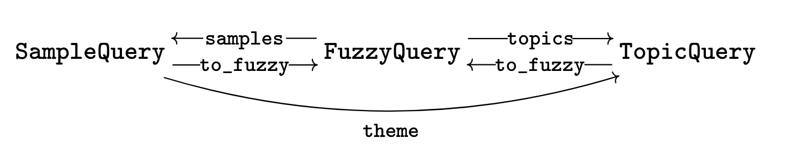

# Thematic Search

Thematic Search is a Python package for *thematic search* on document collections with a hierarchical topic model. It lets you find the most specific topic covering a set of documents, navigate a topic hierarchy, and chain semantic and thematic queries together.

Full documentation is available on [ReadTheDocs](https://thematic-search.readthedocs.io/en/latest/).

## Installation

This is a beta release. You can install from PyPI:

```bash
pip install thematic_search
```

Or install from source:

```bash
git clone git@github.com:kalebruscitti/thematic-search.git
pip install thematic-search
```

## Basic Usage

### What you need

To initialize a `TopicDatabase` you need:

- `embedding_vectors`: an `(n_docs, d)` float array of document embeddings
- `cluster_tree`: a dictionary `{node: [children]}` representing your topic hierarchy, where nodes can be any hashable labels (strings, ints, etc.)
- `cluster_layers`: a list of `(n_docs, n_clusters)` float arrays in `[0,1]`, one per layer, where `cluster_layers[l][j, i]` is the inclusion strength of document `j` in the `i`-th cluster at layer `l`

Optionally:

- `topic_metadata`: a `DataFrame` with a row for each node in `cluster_tree`, indexed by the same node labels
- `document_metadata`: a `DataFrame` with a row for each document
- `reduced_vectors`: an `(n_docs, 2)` array of low-dimensional vectors for visualisation

### Converting your cluster tree

The `convert_tree` utility converts your tree from arbitrary node labels into the internal format required by `SoftClusterTree`, and returns a `cluster_labels` mapping that allows `TopicDatabase` to automatically align your `topic_metadata`:

```python
from thematic_search.utilities import convert_tree

cluster_tree, cluster_labels = convert_tree(my_tree)
```

Layers are assigned automatically (leaves at layer 0, each internal node one layer above its deepest child), or you can supply a custom `layers` dictionary.

### Initializing a TopicDatabase

```python
from thematic_search import TopicDatabase, SoftClusterTree

topicdb = TopicDatabase(
    SoftClusterTree(cluster_layers, cluster_tree),
    embedding_vectors=embedding_vectors,
    reduced_vectors=reduced_vectors,        # optional
    sample_df=document_metadata,          # optional
    topic_df=topic_metadata,                # indexed by your node labels
    cluster_labels=cluster_labels,          # from convert_tree
)
```

If you want to use `topicdb.q.search()`, you will also need to provide an `embedding_model` — a `SentenceTransformer` model matching the one used to produce `embedding_vectors` — either at construction time or by setting `topicdb.embedding_model` before calling `search()`.

### Querying

Queries are accessed via `topicdb.q` and are chainable. The full set of composable queries is given by the arrows in the schema diagram:



Some examples:

```python
# Documents nearest to a query string in embedding space
topicdb.q.neighbours("Advancements in space technology").metadata()

# Most specific topic covering those nearest neighbours
topicdb.q.neighbours("Advancements in space technology").theme().metadata()

# Documents inside a named topic with at least 75% inclusion strength
topicdb.q.topic_name("science").samples(min_strength=0.75).metadata()

# Chain queries: theme of documents inside the parent of a known topic
topicdb.q.topic_name("physics").parents().samples().theme().metadata()
```

## Toponymy Integration

Thematic Search is designed to work out-of-the-box with topic models generated by [Toponymy](https://github.com/TutteInstitute/toponymy). Given a fitted Toponymy object, the `from_topic_model` class method handles the conversion directly:

```python
from toponymy.serialization import TopicModel
from thematic_search import TopicDatabase

topic_model = TopicModel.from_toponymy(toponymy, sample_df=my_document_metadata)
topicdb = TopicDatabase.from_topic_model(topic_model)
```